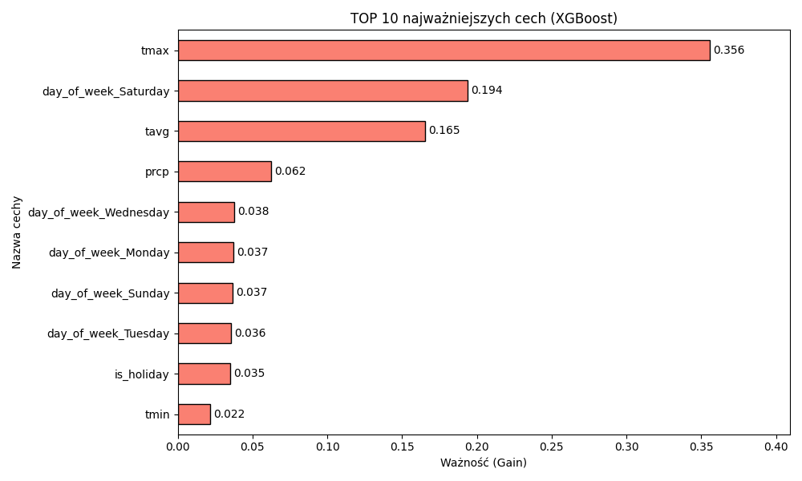
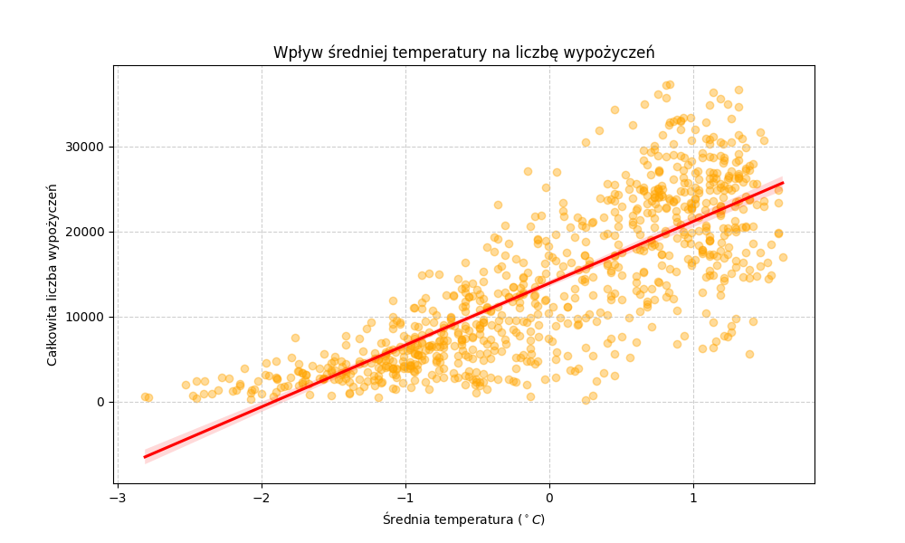
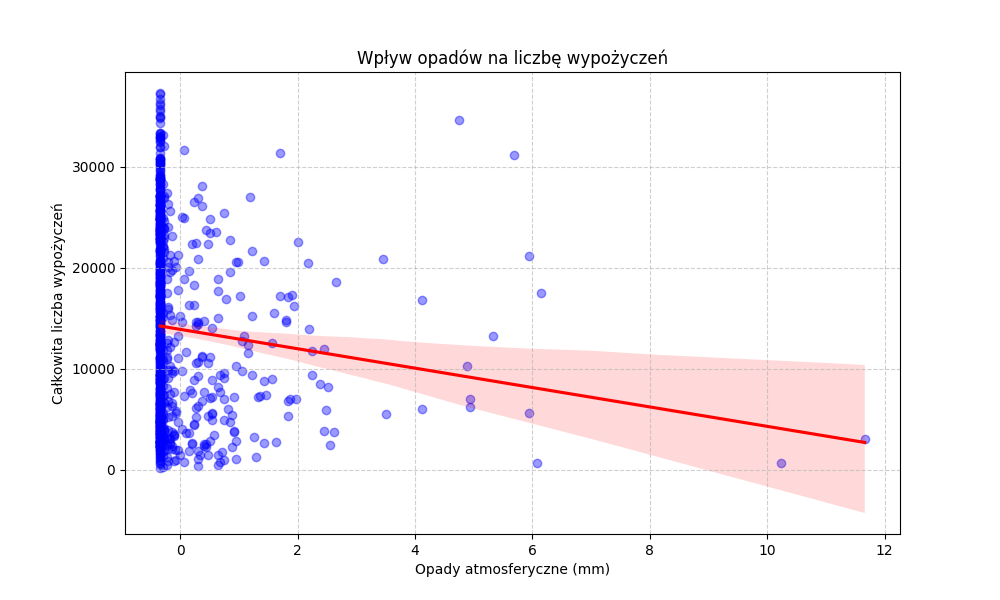

# Źródła i Reprezentacja Danych 2025

Predykcja dziennego zapotrzebowania na rowery miejskie w Chicago. Repozytorium zawiera potok danych (pobranie, czyszczenie, cechy, model) oraz osobno ćwiczenia SQL z zajęć.

## Projekt: Chicago Bike Share

Potok łączy trzy źródła:

- logi wypożyczeń Divvy z Kaggle (`gunnarn/chicago-bicycle-rent-usage`),
- dni ustawowo wolne w Illinois (scraping Office Holidays),
- pogodę ze stacji Chicago O'Hare (Meteostat).

Dzienne wolumeny przejazdów są zmienną objaśnianą. Model to `XGBRegressor`. Wyniki pośrednie zapisują się jako Apache Parquet, a nie CSV.

### Struktura

```text
pipeline/                 skrypty 01–07, uruchamiane po kolei
notebooks/dokumentacja.ipynb
data/raw/                 CSV z Kaggle (nie trafia do gita)
data/processed/           pliki Parquet (nie trafiają do gita)
outputs/figures/          wykresy z etapów 06 i 07
sql/                      ćwiczenia Oracle SQL / PL/SQL
requirements.txt
```

### Instalacja

Python 3.11+. W katalogu repozytorium:

```bash
python -m venv .venv
.venv\Scripts\activate
pip install -r requirements.txt
```

Do notatnika dodatkowo: `pip install jupyter`.

Kaggle wymaga klucza API. Najprościej plik `kaggle.json` w `%USERPROFILE%\.kaggle\` (instrukcja: [Kaggle API](https://www.kaggle.com/docs/api)).

### Uruchomienie

Z katalogu głównego repozytorium, w tej kolejności:

```bash
python pipeline/01_akwizycja.py
python pipeline/02_walidacja.py
python pipeline/03_swieta.py
python pipeline/04_pogoda.py
python pipeline/05_integracja.py
python pipeline/06_model.py
python pipeline/07_analiza.py
```

| Skrypt | Co robi |
| --- | --- |
| `01_akwizycja.py` | Pobiera CSV, scala je i zostawia kolumnę czasu startu |
| `02_walidacja.py` | Sprawdza zakres dat i liczbę przejazdów |
| `03_swieta.py` | Zbiera święta Illinois 2020–2022 |
| `04_pogoda.py` | Pobiera temperaturę i opady, uzupełnia braki |
| `05_integracja.py` | Agreguje dni, łączy tabele, koduje dzień tygodnia, standaryzuje pogodę |
| `06_model.py` | Trenuje XGBoost (80/20), liczy MAE i R², zapisuje ważność cech |
| `07_analiza.py` | Wykresy regresji: temperatura i opady vs. liczba wypożyczeń |

Notatnik `notebooks/dokumentacja.ipynb` opisuje te same etapy. Komórki zakładają katalog roboczy w korzeniu repozytorium. Zapisane wyjścia pochodzą z pierwotnego przebiegu.

### Wyniki

Wykresy z ostatniego przebiegu:







Surowe CSV i Parquet nie są w gicie: poprzednia wersja miała puste placeholdery (0 bajtów). Odtwarza je skrypt `01` oraz kolejne etapy.

## Ćwiczenia SQL

Osobny materiał z zajęć, schemat HR w Oracle:

| Plik | Zakres |
| --- | --- |
| `sql/cw01_schemat.sql` | Tabele, klucze, `FLASHBACK` |
| `sql/cw02_zapytania.sql` | Odtworzenie schematu i zapytania |
| `sql/cw03_analityczne.sql` | Funkcje okna, `sales` / `products` |
| `sql/cw04_widoki.sql` | Widoki, DML, `WITH CHECK OPTION` |
| `sql/cw05_plsql.sql` | Bloki anonimowe, kursory, procedury |
